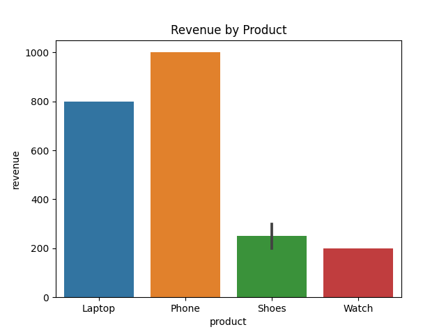
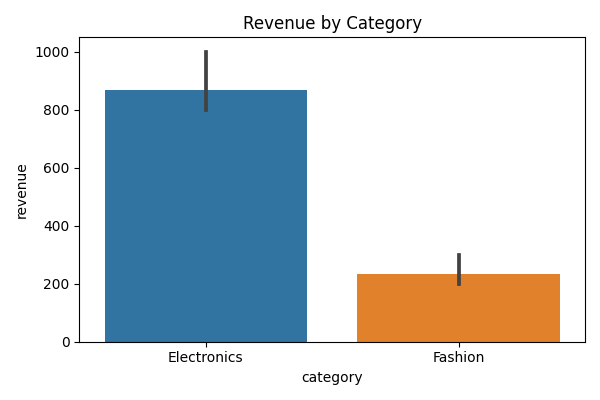
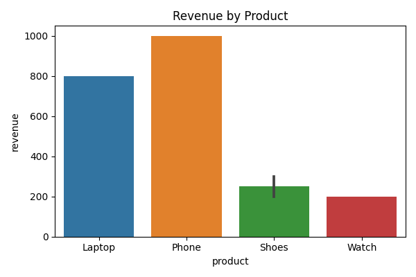
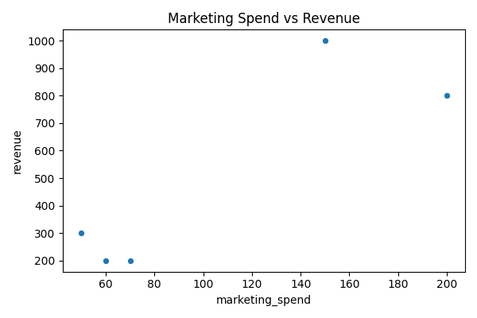

# 📊 Task 2: Exploratory Data Analysis (EDA) & Business Intelligence

## 📌 Internship
Data Analytics Internship  
ApexPlanet Software Pvt. Ltd.

---

## 🎯 Objective
The objective of this task was to perform Exploratory Data Analysis (EDA) to uncover trends, relationships, and business insights from the dataset. The task involved analyzing revenue patterns, marketing impact, and product/category performance.

---

## 🛠 Tools & Technologies Used
- Python
- Pandas
- Matplotlib / Seaborn
- SQLite (database.db)
- Git & GitHub

---

## 📂 Project Files

| File Name | Description |
|------------|-------------|
| `data.csv` | Original dataset used for analysis |
| `database.db` | SQLite database for structured querying |
| `eda_analysis.py` | Python script containing full EDA process |
| `marketing_vs_revenue.png` | Visualization of marketing spend vs revenue |
| `revenue_by_category.png` | Revenue distribution across categories |
| `revenue_by_product.png` | Revenue generated by individual products |
| `revenue_chart.png` | Overall revenue trends |

---

## 🔍 Analysis Performed

✔️ Data loading and inspection  
✔️ Descriptive statistics (mean, distribution, trends)  
✔️ Correlation analysis  
✔️ Revenue comparison across categories  
✔️ Marketing impact analysis  
✔️ Visualization of key business metrics  

---

## 📈 Key Insights

- Identified top-performing product categories.
- Analyzed relationship between marketing spend and revenue generation.
- Observed revenue distribution trends.
- Highlighted products contributing the highest revenue share.

---

## 📊 Sample Visualizations

### Revenue Trends

### Revenue by Category

### Revenue by Product

### Marketing vs Revenue

